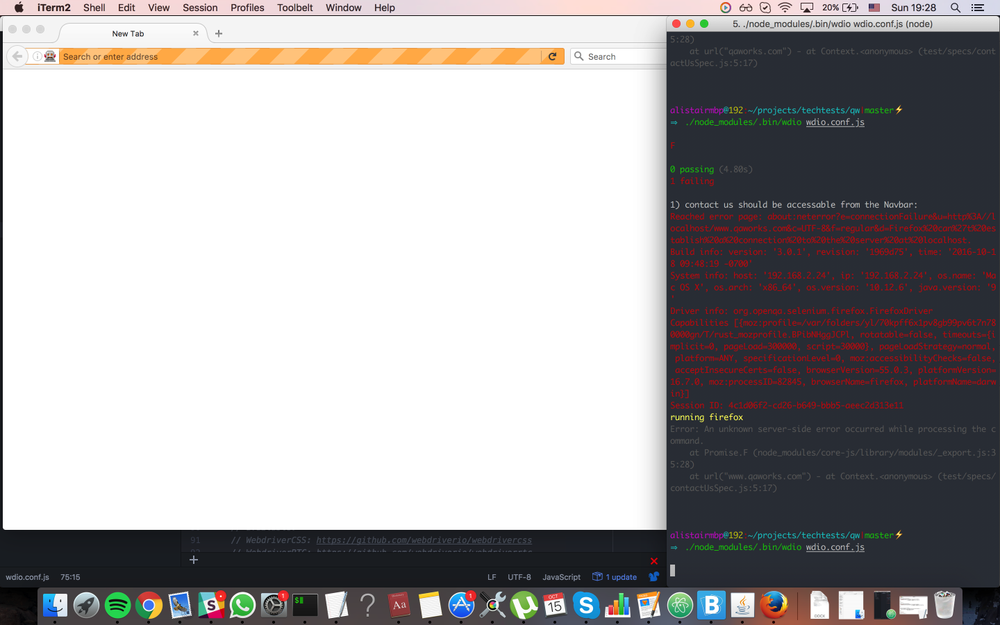

# webdriver-test
Learning to write an automated feature test using WebdriverIO.

## Acceptance Test
```
Scenario: Valid Submission
Given I am on the QAWorks Site
Then I should be able to contact QAWorks with the following information
| name    | j.Bloggs                                  |     
| email   | j.Bloggs@qaworks.com                      |
| subject   | test automation                     |     
| message | please contact me I want to find out more |
```

## How to run tests
1. Clone repository
2. Run `$ npm install`
3. Ensure Java SE 9 is installed
4. Run `$ java -jar -Dwebdriver.gecko.driver=./geckodriver selenium-server-standalone-3.6.0.jar`
5. In open the cloned directory in a new Terminal window
6. Run `$ ./node_modules/.bin/wdio wdio.conf.js`

## Challenges
* Due to me following the outdated developer guide on webdriver.io, I was running on outdated versions of selenium-server and geckodriver.
  This caused many of the selectors to throw an error, leading to an hour of debugging.
  Thankfully through rubber duck debugging skills picked up at Makers, I eventually realised to check the dependency versions.
  
    

## Improvements
* Refactoring the test code with some helper functions to DRY(Don't repeat yourself) up the code.
* For testing for required fields, currently .wpcf7-not-valid-tip is used as a selector for all three required fields and is not a specific identifier.
  If I had more time I would try to find a way to use a more specific selector.
